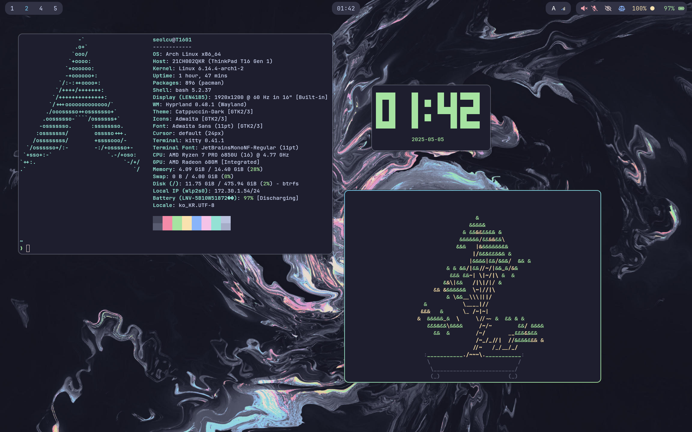

# dotfiles



Modern Hyprland rice with Catppuccin theme.

## Color Info

- Colorscheme: Catppuccin
- Variant: Mocha
- Accent Color: Sapphire
- Secondary Color: Green

## Other materials

- **Wallpaper**: [github: walls-catppuccin-mocha](https://github.com/orangci/walls-catppuccin-mocha/blob/master/abstract-swirls.jpg)
- **GTK Theme**: [Catppuccin GTK theme](https://github.com/Fausto-Korpsvart/Catppuccin-GTK-Theme)
- **Icon Theme**: Adwaita
- **Fonts**: [JetBrainsMono Nerd Font](https://www.nerdfonts.com/font-downloads)

## How-to

> Before applying this config, please make sure to read the configs and modify for your use case. I do not guarantee this config to work on every machine.

1. install arch linux
2. clone this repo to your home directory
3. cd into this directory
4. run `./install.sh`

## Gaming options

### Non-HDR

```bash
gamemoderun %command%
```

### HDR

Might have to disable Steam Input.

#### Wine-Wayland option:

Install proton-ge-custom-bin (AUR), change to Proton-GE

```bash
PROTON_ENABLE_WAYLAND=1 PROTON_ENABLE_HDR=1 gamemoderun %command%
```

#### Gamescope option:

```bash
DXVK_HDR=1 gamemoderun gamescope -W 2560 -H 1440 -r 165 --hdr-enabled -f -- %command%
```
